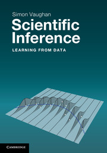

# Scientific-Inference

_Scientific Inference: Learning from Data_ is a book introducing ideas of probability, statistics, computing, data handling and the scientific method. It is aimed at students of the physical sciences. 

## Data

The book features lots of worked examples of data analysis - using the R computing language. The data sets can be downloaded from the [data/](data/) directory. 

## Exercises

There is a set of exercises to go along with the book. Download the [PDF here](docs/exercises.pdf)

## Errata

Keen readers and students have spotted the occasional error. Here is the latest [list of errors](docs/errata.txt). If you notice any more, please do email me. 

## Available from

* [CUP](http://www.cambridge.org/9781107607590)
* [Blackwells](https://bookshop.blackwell.co.uk/bookshop/product/Scientific-Inference-by-Simon-Vaughan/9781107607590)
* [Amazon UK](http://www.amazon.co.uk/Scientific-Inference-Learning-Simon-Vaughan/dp/1107607590/) or [Amazon US](http://www.amazon.com/Scientific-Inference-Learning-Simon-Vaughan/dp/110702482X/)

## Blurb

Providing the knowledge and practical experience to begin analysing scientific data, this book is ideal for physical sciences students wishing to improve their data handling skills. The book focuses on explaining and developing the practice and understanding of basic statistical analysis, concentrating on a few core ideas, such as the visual display of information, modelling using the likelihood function, and simulating random data. Key concepts are developed through a combination of graphical explanations, worked examples, example computer code and case studies using real data. Students will develop an understanding of the ideas behind statistical methods and gain experience in applying them in practice. 

## Reviews

_"a well-written compact calculus-based introductory statistics and data analysis textbook... should be read by anyone with a calculus background wanting a brief, but good, introduction to statistics."_ - D. Bellhouse (2014; The American Statistician, 68:4, 307)

_"the presentation of known topics happens in an imaginative way... provides innovative and intelligent comments and connecting elements"_ - N. E. Myridis (2014, Contemporary Physics, 55:3, 339)
